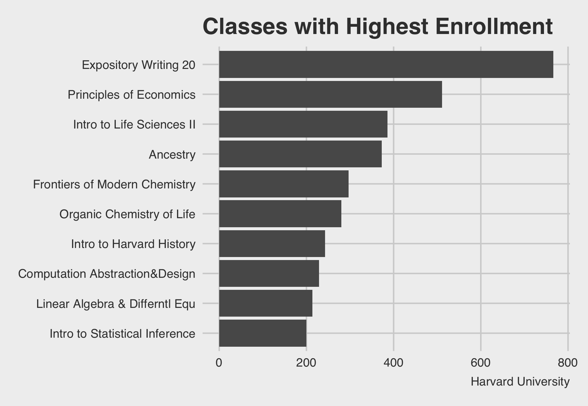

```{r setup, include=FALSE}
knitr::opts_chunk$set(echo = FALSE)
library(tidyverse)
library(primer.data)
library(readxl)
library(janitor)
library(ggthemes)

enrollment <- read_excel("raw_data/class_enrollment_summary_by_term_2-10-2021.xlsx", 
                         skip = 3)
```


```{r}
enrollment_p <- enrollment %>%

# Some variable names had spaces which made for inconvenient typing. Installing 
# janitor and using clean names fixed this quickly. 
  
  clean_names() %>%
  
# Initially we only grouped by course name, in effort to include classes like 
# EXPOS, which have several different sections, but are fundamentally the same
# class. When doing so, we found other courses, e.g. Junior Tutorial, also have
# the same course name but our not the same class. Grouping by course id allowed
# us to make this distinction. 
  
  select(course_name, course_id, total) %>%
  drop_na(course_name) %>% 
  group_by(course_id, course_name) %>% 

# Summarize with no group options specified gave us some trouble, when we tried 
# to slice and eventually sliced groupwise, giving us much more than 10 classes, 
# since ittried to slice the top 10 from each group. Drop groups took care of 
# this.
  
  summarize(sum_total = sum(total), .groups = "drop") %>% 
  arrange(desc(sum_total)) %>% 
  slice(1:10) %>% 
  ggplot(mapping = aes(fct_reorder(course_name, sum_total), sum_total)) +
  geom_col() +
  coord_flip() +
  labs(title = "Classes with Highest Enrollment", 
       x = "Total", 
       y = "Classes", 
       caption = "Harvard University") +
  
  # New favorite theme. Thanks Shai-Li.
theme_fivethirtyeight()
```


```{r}

```

